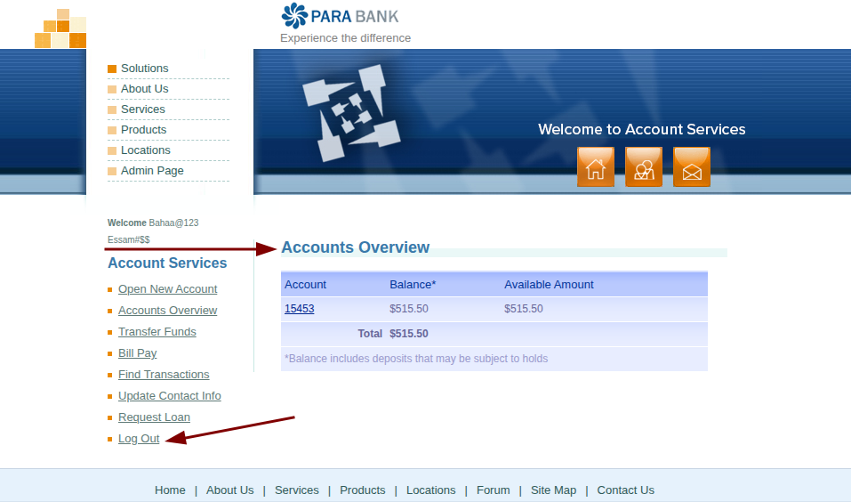
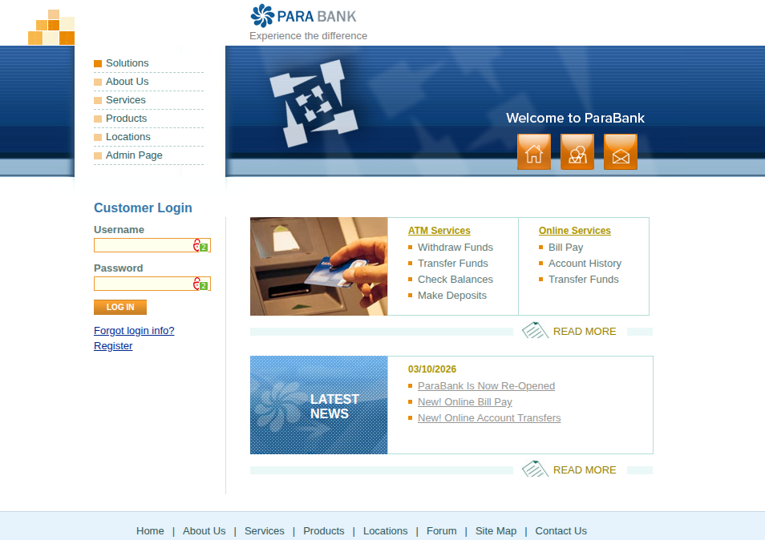
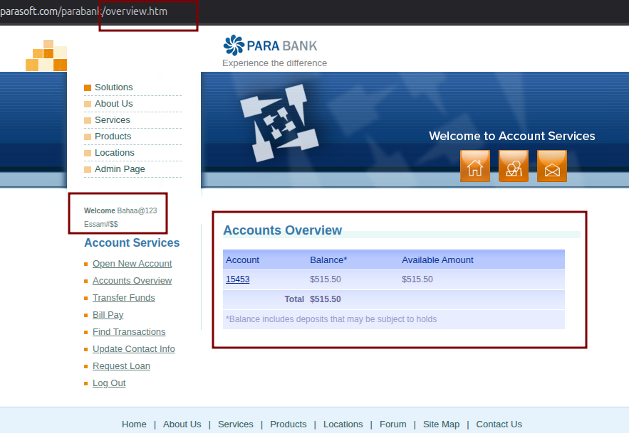

# BUG-AUTH-001: [Security] Insecure Session Management allows access to secure pages via browser 'Back' button after logout

**Defect ID:** BUG-AUTH-001  
**Module:** Authentication - Session Management  
**Reporter:** Bahaa Eldin Essam  
**Date:** 10-03-2026  
**Status:** New

## Environment & Configuration
* **Primary Environment:** Windows 11 / Chrome 122.0

## Severity & Priority
* **Severity:** Critical
* **Priority:** High

## Pre-conditions
* User is registered and possesses valid login credentials.

## Steps to Reproduce
1. Log in to the application using valid credentials.
2. Verify redirection to the secure 'Accounts Overview' page.
3. Click the 'Log Out' link from the navigation menu.
4. Verify redirection to the public Home/Login page.
5. Click the browser's 'Back' button.

## Expected Result
* Access is strictly denied.
* The system recognizes the session as terminated and forces the user to remain on the public page or prompts for re-authentication.

## Actual Result
* The system allows access to the secure 'Accounts Overview' page.
* The user is able to view account details despite having formally logged out, indicating the session token is not properly invalidated on the server or client side.

## Attachments / Evidence

**Evidence 1: State after successful login** 

**Evidence 2: State after logging out** 

**Evidence 3: State after clicking Back button (Vulnerability)** 