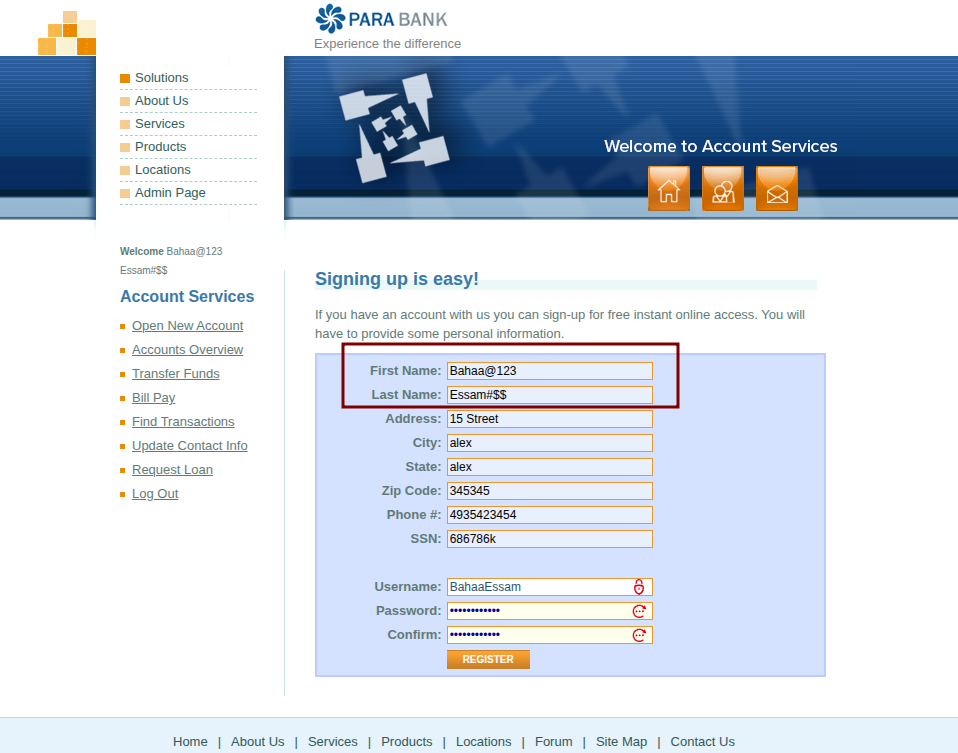
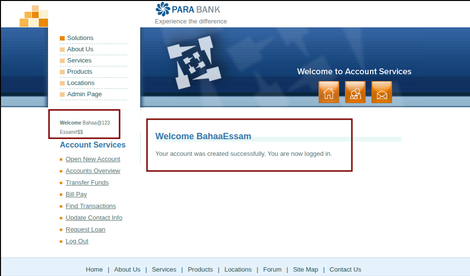

# BUG-REG-001: [Registration] System allows account creation with special characters in Name fields

**Defect ID:** BUG-REG-001  
**Module:** Authentication - Registration  
**Reporter:** Bahaa Eldin Essam  
**Date:** 10-03-2026  
**Status:** New

## Environment & Configuration
* **Primary Environment:** Windows 11 / Chrome 122.0

## Severity & Priority
* **Severity:** Medium
* **Priority:** Medium

## Pre-conditions
* User is on the ParaBank Registration page.

## Steps to Reproduce
1. Navigate to the Registration page.
2. In the 'First Name' field, enter a string containing special characters (e.g., `Bahaa@123`).
3. In the 'Last Name' field, enter a string containing special characters (e.g., `Essam#$$`).
4. Fill in all remaining mandatory fields with valid data.
5. Click the 'Register' button.

## Expected Result
* Registration is strictly blocked by the system.
* A validation error indicating invalid characters in the name fields is displayed (e.g., "Names can only contain alphabetic characters").

## Actual Result
* The registration is processed successfully without any validation blocks.
* The system logs the user in and displays a welcome message containing the special characters.

## Attachments / Evidence

**Evidence 1: Input Data with Special Characters** 

**Evidence 2: Successful Registration Confirmation (Validation Bypass)** 