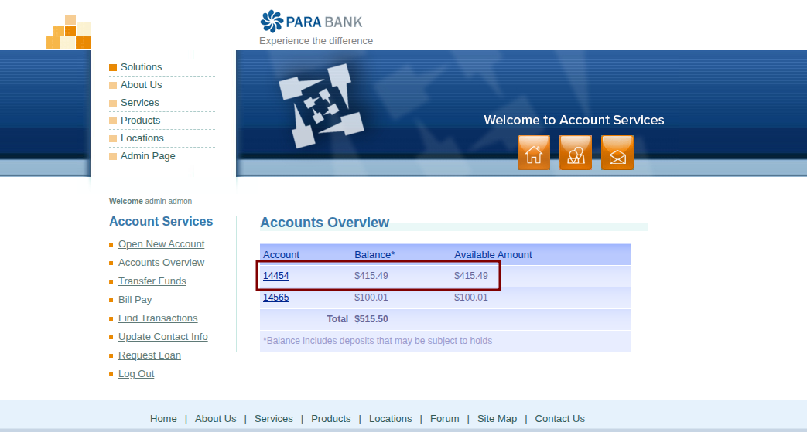
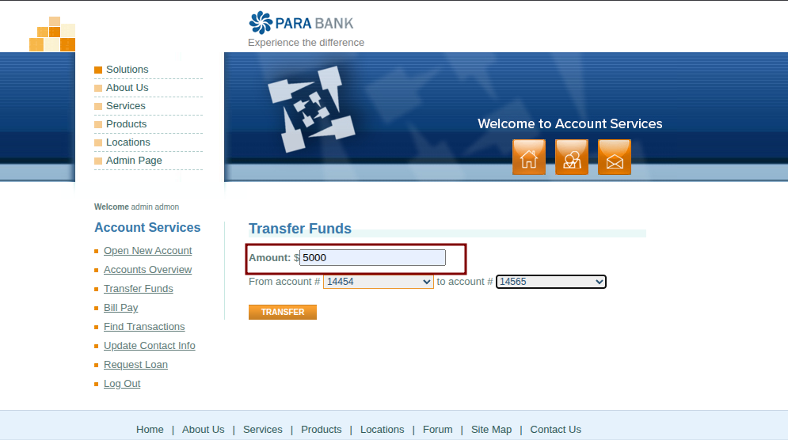
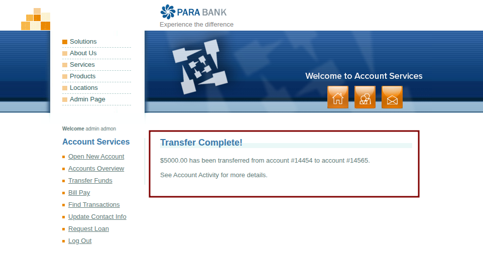
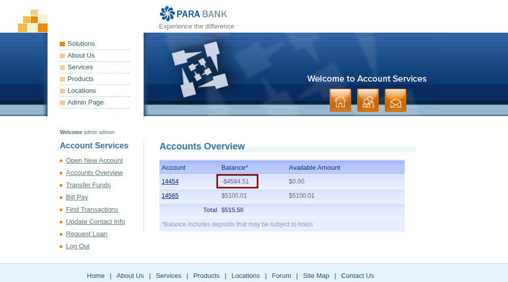

# BUG-TRF-001: [Fund Transfer] System allows transferring amounts exceeding available balance

**Defect ID:** BUG-TRF-001  
**Module:** Account Services - Fund Transfer  
**Reporter:** Bahaa Eldin Essam  
**Date:** 07-03-2026  
**Status:** New

## Environment & Configuration
* **Primary Environment:** Windows 11 / Chrome 122.0
* **Reproducibility Note:** This defect is a backend business logic failure. It has been consistently reproduced across multiple OS environments (Windows 11, Linux) and different browsers (Chrome, Edge, Brave).

## Severity & Priority
* **Severity:** Critical
* **Priority:** High

## Pre-conditions
* User is authenticated and logged in.
* Source account has a known positive balance (e.g., $515.50).

## Steps to Reproduce
1. Navigate to the 'Transfer Funds' page.
2. In the 'Amount' field, enter a value strictly greater than the available balance (e.g., `5000`).
3. Select a valid source account from the 'From account' dropdown.
4. Select a valid destination account from the 'To account' dropdown.
5. Click the 'Transfer' button.
6. Navigate to 'Accounts Overview' to verify the updated balances.

## Expected Result
* The transfer request is blocked by the system.
* A validation error is displayed (e.g., "Insufficient Funds").
* The source account balance remains unchanged.

## Actual Result
* The transfer is processed successfully without any validation blocks ("Transfer Complete!" message appears).
* The source account balance is improperly deducted, resulting in a negative balance (e.g., `-$4484.50`).

## Attachments / Evidence

**1. Initial Account Balance:**

**2. Transfer Request (Excess Amount):**

**3. Transfer Success Message (The Bug):**

**4. Final Balance (Negative Result):**

