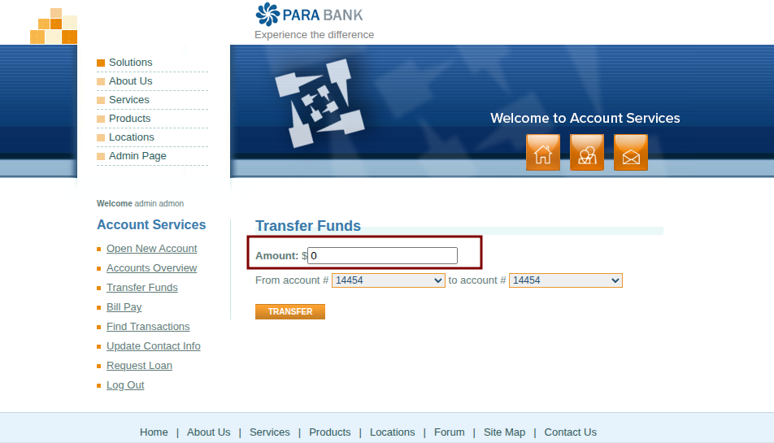
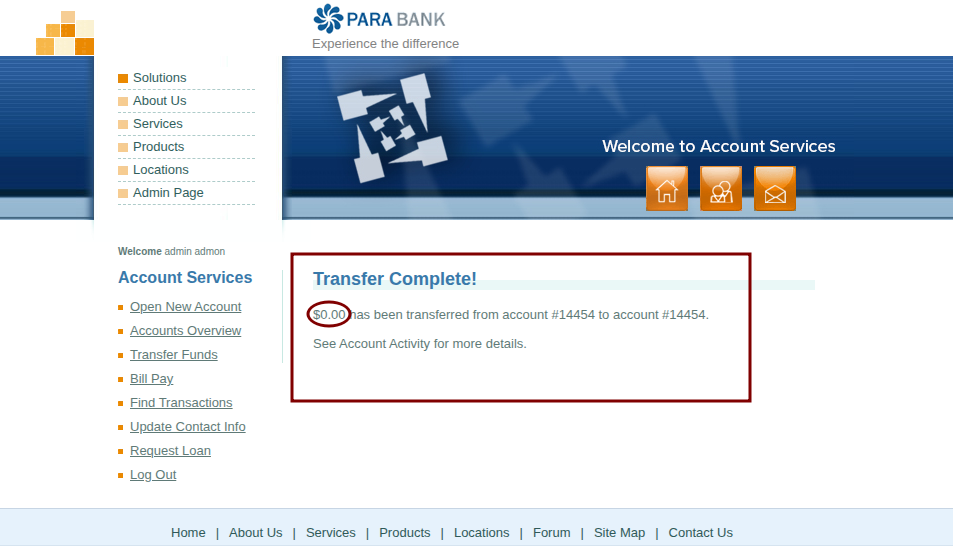

# BUG-TRF-002: [Fund Transfer] System allows transfer of $0.00 (Zero Amount)

**Defect ID:** BUG-TRF-002  
**Module:** Account Services - Fund Transfer  
**Reporter:** Bahaa Eldin Essam  
**Date:** 07-03-2026  
**Status:** New

## Environment & Configuration
* **Primary Environment:** Windows 11 / Chrome 122.0
* **Reproducibility Note:** Backend logic failure. Lack of zero-value validation.

## Severity & Priority
* **Severity:** Medium
* **Priority:** Medium

## Pre-conditions
* User is authenticated and logged in.

## Steps to Reproduce
1. Navigate to 'Transfer Funds'.
2. Enter `0` in the Amount field.
3. Select any accounts and click 'Transfer'.

## Expected Result
* Error message: "Amount must be greater than zero."

## Actual Result
* System processes $0.00 transfer successfully.

## Attachments / Evidence

