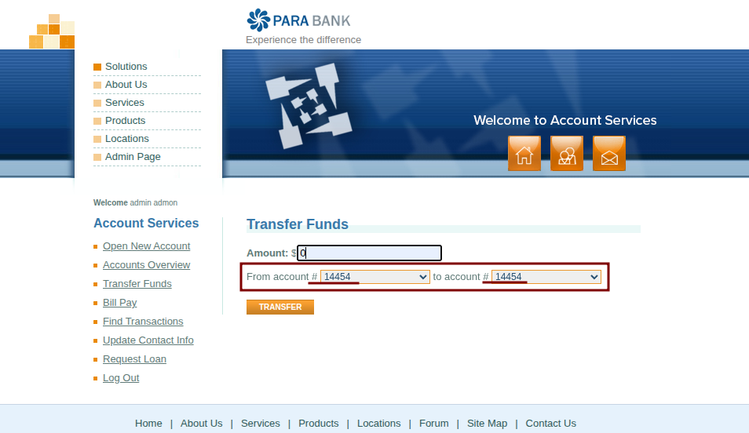
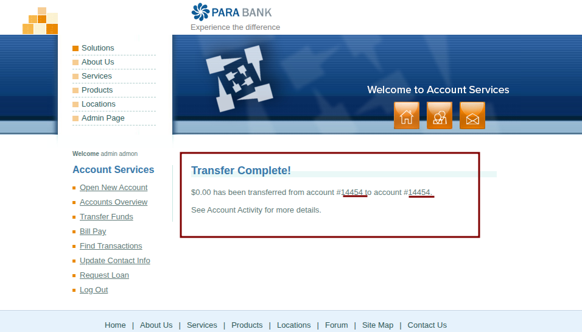

# BUG-TRF-003: [Fund Transfer] System permits transferring funds to the same source account

**Defect ID:** BUG-TRF-003  
**Module:** Account Services - Fund Transfer  
**Reporter:** Bahaa Eldin Essam  
**Date:** 07-03-2026  
**Status:** New

## Environment & Configuration
* **Primary Environment:** Windows 11 / Chrome 122.0

## Severity & Priority
* **Severity:** Medium
* **Priority:** Medium

## Steps to Reproduce
1. Navigate to 'Transfer Funds'.
2. Enter any valid amount.
3. Select the same account in both 'From' and 'To' dropdowns (e.g., #14454).
4. Click 'Transfer'.

## Expected Result
* System blocks the transaction with a logical error.

## Actual Result
* System confirms transfer between identical account IDs.

## Attachments / Evidence

