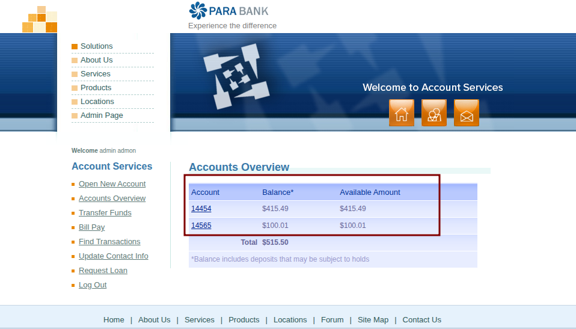
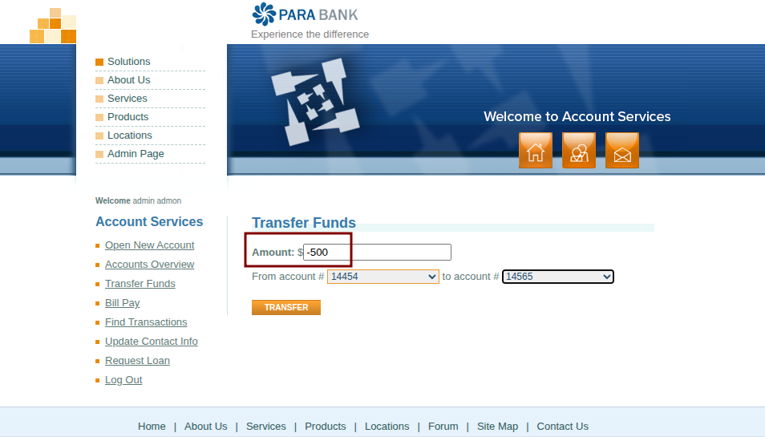
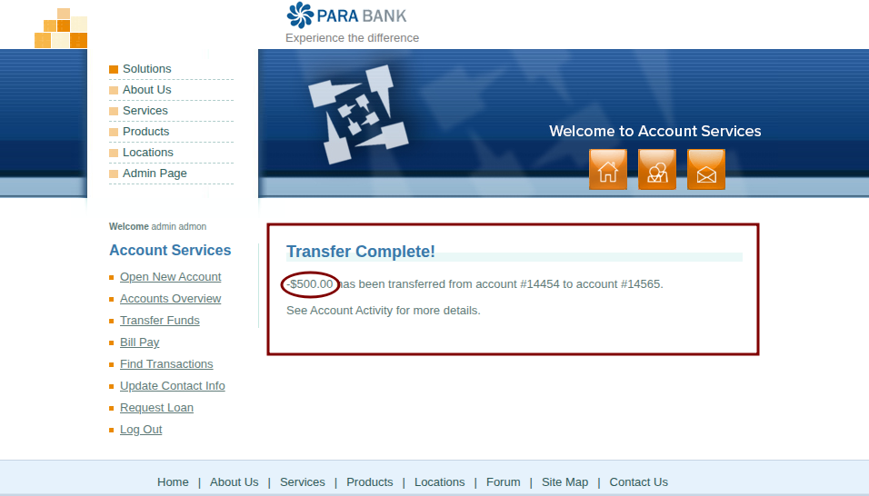
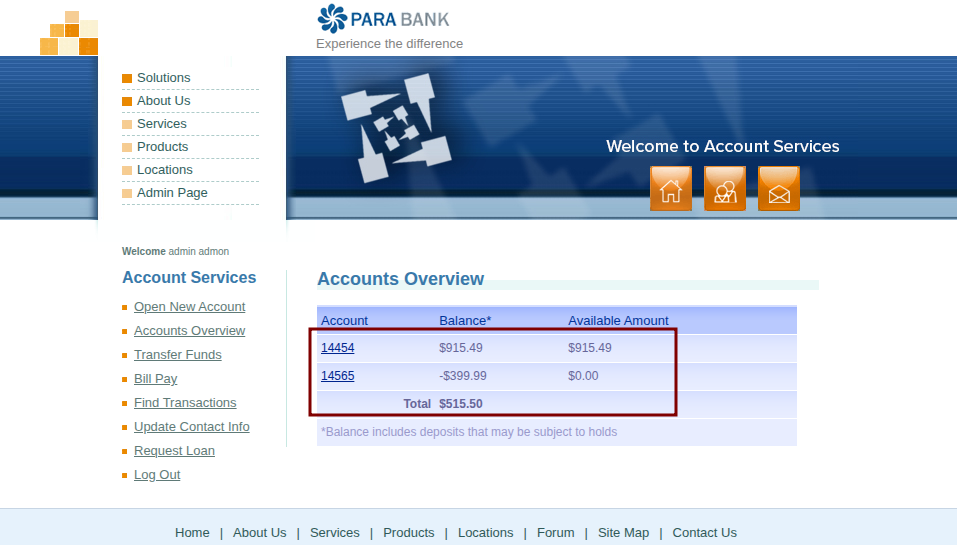

# BUG-TRF-004: [Fund Transfer] System allows transferring negative amounts, resulting in a reverse transfer exploit

**Defect ID:** BUG-TRF-004  
**Module:** Account Services - Fund Transfer  
**Reporter:** Bahaa Eldin Essam  
**Date:** 08-03-2026  
**Status:** New

## Environment & Configuration
* **Primary Environment:** Windows 11 / Chrome 122.0
* **Reproducibility Note:** This is a critical backend logic and security failure. The system lacks absolute value validation, causing negative inputs to reverse the mathematical operation (adding to the source and deducting from the destination).

## Severity & Priority
* **Severity:** Critical
* **Priority:** High

## Pre-conditions
* User is authenticated and logged in.
* Two distinct valid accounts exist (e.g., source: 14454, destination: 14565).

## Steps to Reproduce
1. Navigate to the 'Accounts Overview' page to check initial balances.
2. Navigate to the 'Transfer Funds' page.
3. In the 'Amount' field, enter a negative value (e.g., `-500`).
4. Select a valid source account from the 'From account' dropdown.
5. Select a valid destination account from the 'To account' dropdown.
6. Click the 'Transfer' button.
7. Navigate to 'Accounts Overview' to verify the updated balances.

## Expected Result
* The transfer request is strictly blocked by the system.
* A validation error is displayed (e.g., "Amount must be a positive number").
* Both account balances remain unchanged.

## Actual Result
* The transfer is processed successfully without any validation blocks ("Transfer Complete!" message appears).
* The transaction operates in reverse: the negative amount is ADDED to the source account balance, and DEDUCTED from the destination account balance.

## Attachments / Evidence

**1. Initial Account Balances:**

**2. Transfer Request (Negative Amount Input):**

**3. Transfer Success Message (The Bug):**

**4. Final Balances (Exploit Result):**
